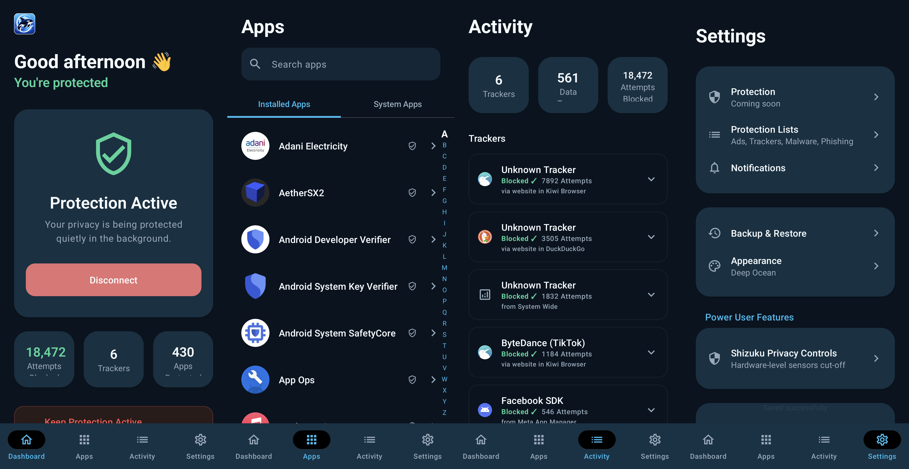

  
  
  # Triora: Android Firewall & VPN
  
  **We quietly protect your digital life. 🍀**
   
  *Built for People. We build for users—not advertisers.*

---

## 🌊 Overview

Triora is a next-generation Android Firewall and Privacy VPN designed to block ads, trackers, malware, and phishing attempts across your entire device. Triora reroutes your DNS traffic through a highly optimized, local filtering engine that acts instantly—preventing data harvesting before it even leaves your device.

## 🛡️ Our Principles

- **Private by Design:** Your privacy comes first.
- **Simple by Choice:** Privacy shouldn't be complicated.
- **Transparent by Default:** See what we're protecting and why.
- **Built for People:** We build for users—not advertisers.

## ✨ Features

- **Local Filtering Engine:** Powerful DNS-level blocking for Ads, Trackers, and Malware.
- **Dynamic Theming:** Seamlessly swap between the gorgeous **Deep Ocean** (Aqua) and **Forest Night** (Green) UI aesthetics.
- **Real-Time Analytics:** Beautiful dashboard with live odometer stats showing exactly how many trackers were blocked today.
- **In-Depth App Insights:** See exactly which apps are leaking data, including tracker names, risk levels, and blocking frequency.
- **Custom Protection Lists:** Add custom domain blocklists (OISD, AdAway, 1Hosts, etc.) to tailor your security.

## 🎨 Design Philosophy

Triora features a strict semantic design system utilizing vibrant neon accents against deep charcoal and ocean backgrounds. 
- **Aqua (Primary):** Interactive UI elements
- **Green (Protected):** Safety and active shields
- **Amber (Warning):** Attention-required states
- **Red (Danger):** Disconnected or blocked elements

## 🚀 Getting Started

1. Clone this repository.
2. Open the project in **Android Studio**.
3. Build and run the `app` module on an emulator or physical device.
4. Enjoy a cleaner, safer digital life!

## 📱 Application Interface

  

